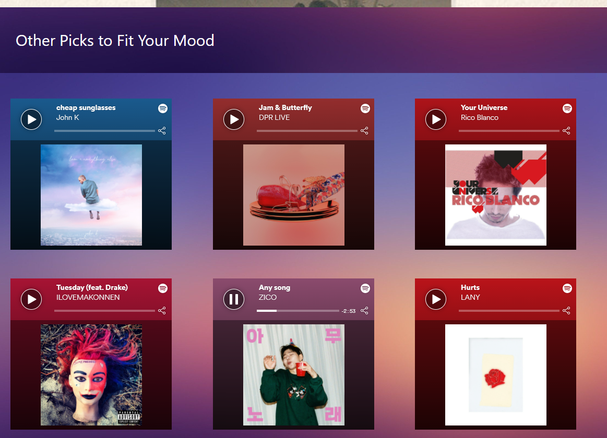

## Mood Melody
Enter your thoughts and we will recommend you music!

## Features
- Type your thoughts (or anything you want to type) into the search bar, and the program will analyze the overall sentiment and emotions in those thoughts.
  - The sentiment of the thoughts are understood using Google Cloud's Natural Language API.
- The program will then give recommended songs based on the user’s overall sentiment and different factors.
  - Factors include danceability, instrumentalness, liveness, speechiness, valence, and more. 
  - Songs are received from Spotify's Browse API.
- The recommended songs are randomized and never the same, even if the user enters the same thoughts. 
- The user can find our top pick for their mood displayed right when they search. 
- The user can also browse through other picks to see what else they might like. 
- If the user finds something that they like, they can easily sample and share songs through our app to feel the vibes and spread their mood.

## Screenshots:
### **Search Screen**

### **Top Pick Result**

### **Other Picks**

### **Share and Explore**

Thank you for reading!
